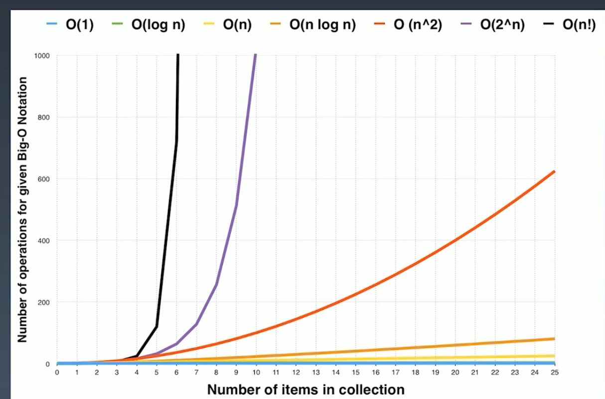

1. 刻意练习 top tip 
2. clean code
    - 高层次主干逻辑为主（主干为主，不要纠结其细节）
3. 时间复杂度和空间复杂度
    - 针对工程性代码和基本算法都应该养成分析【时间复杂度】和【空间复杂度】的习惯
      - O(1) 常数时间复杂度
      - O(log n) 对数时间复杂度
      - O(n) 线性时间复杂度
      - O(n ^ 2) 平方
      - O(n ^ 3) 立方
      - O(n!) Factorial 阶乘
    - 最好能够用最简洁的时间、空间复杂度完成代码是职业选手必备的素养 如下图
    
    - 根据主定理计算时间复杂度。
    
    - 常用时间复杂度分析
      - 所有排序最好的时间复杂度为**nlogn**
      - 树遍历，前序中序后续遍历的时间复杂度为**O(n)**, n代表树的总节点数，通过主定理可以推算得出,或者说前中后序遍历树中每个节点有且仅访问一次，所以时间复杂度是线性与这个树的节点总数.
      - 图遍历，同理可得图和树的时间复杂度也是一样为**O(n)**.
      - 搜索算法，DFS、BFS，因为访问的节点是访问一次，都是**O(n)**，n指的是搜索空间的节点总数.
      - 二分查找，logn 